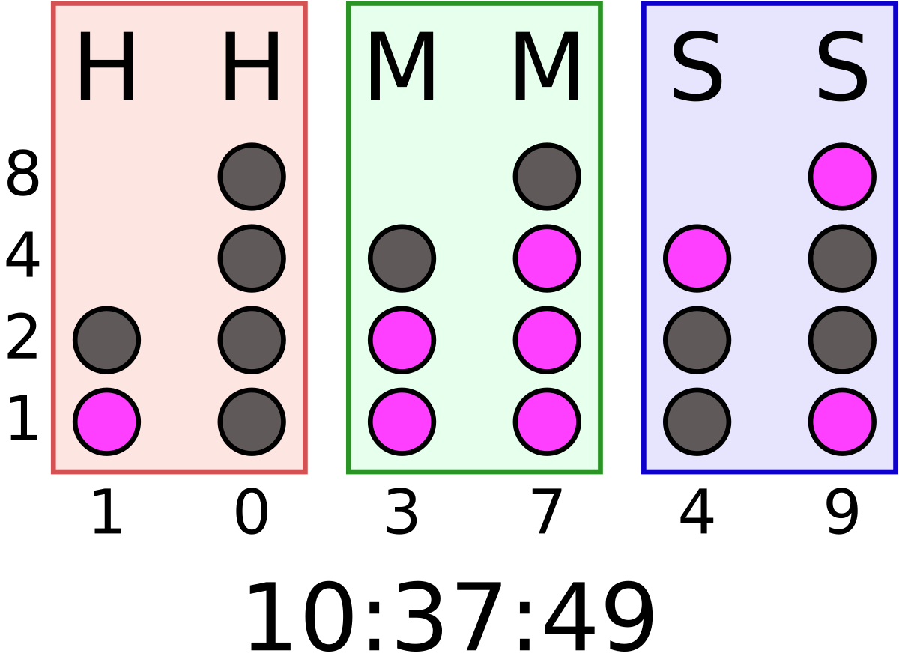

# Binary Clock
### Realizado por Adr1Est

## Funcionamiento

### Hecho con: 

### Subido a: 
[!netlify](https://img.shields.io/badge/Netlify-%20-lightgrey?logo=netlify)](https://binary-clock-aes.netlify.app/)
